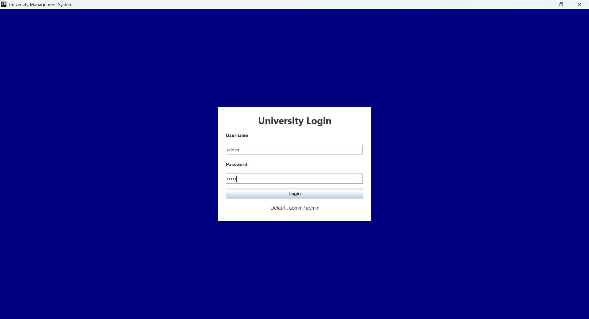
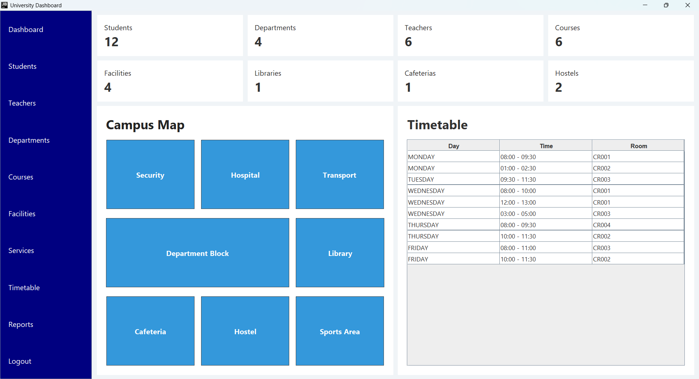
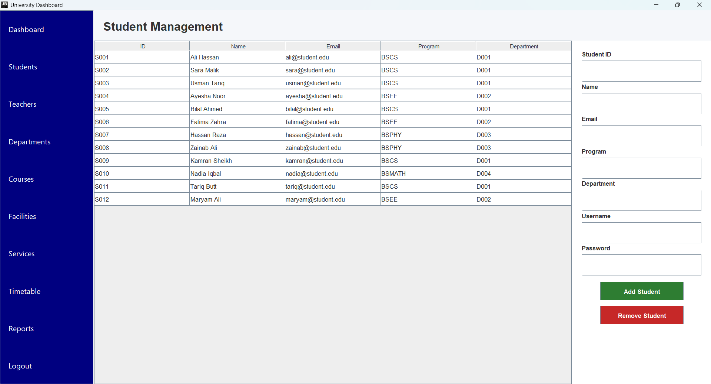
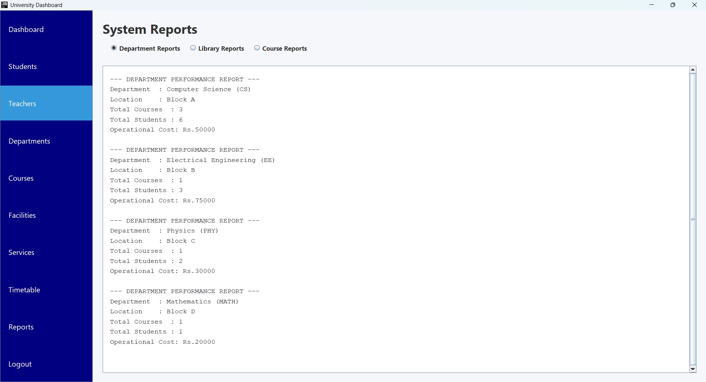

<div align="center">

# 🎓 Smart University Campus Management System

### A full-featured desktop application built in pure Java — managing students, faculty, courses, facilities, and campus services with clean OOP design.

<br>


<br>

[🚀 Quick Start](#quick-start) · [✨ Features](#features-at-a-glance) · [🔷 OOP Concepts](#oop-concepts) · [🔑 Credentials](#default-credentials)

</div>

---

## Overview

This is a **complete, fully functional** University Campus Management System — not a demo, not a stub. Built as an OOP semester project at **COMSATS University Islamabad**, it manages the real operational complexity of a university in one cohesive Java Swing desktop application.

> **Admin** controls everything. **Teachers** manage courses and view students. **Students** view their timetable and reports. Every action is persisted to disk automatically.

**What makes this stand out:**
- A classroom marked unavailable **auto-reschedules every affected course** to the next available room
- A medical emergency **chain-notifies Security** via the `Notifiable` interface — no coupling
- Peak-hour toggle on Transport **dynamically regenerates all route schedules**
- A background daemon **auto-saves state every 60 seconds** with backup before every write

---

## Screenshots

| Login Screen | Main Dashboard |
|---|---|
|  |  |

| Student Panel | System Reports |
|---|---|
|  |  |

---

## Table of Contents

- [Overview](#overview)
- [Screenshots](#screenshots)
- [Tech Stack](#tech-stack)
- [Features at a Glance](#features-at-a-glance)
- [OOP Concepts](#oop-concepts)
- [Quick Start](#quick-start)
- [Default Credentials](#default-credentials)
- [Architecture](#architecture)
- [Project Structure](#project-structure)
- [Role-Based Access](#role-based-access)
- [Author](#author)

---

## Tech Stack

| | Technology | Purpose |
|---|---|---|
| **Language** | Java 17+ | Core application logic |
| **GUI** | Java Swing | Window, panels, tables, forms |
| **Persistence** | Java Serialization | `.dat` file save/load with backup |
| **Pattern** | MVC (4-layer) | GUI → Controller → Model → Persistence |
| **Dependencies** | None | Pure Java — no Maven, no libraries |

---

## Features at a Glance

| 🎓 Academic Management | 🏢 Campus Facilities | ⚙️ Campus Services |
|---|---|---|
| Student CRUD | Library + book checkout & return | Transport routes |
| Teacher CRUD | Cafeteria seat tracking | Peak-hour schedule regeneration |
| Course CRUD | Hostel room allocation | Security incident log |
| Department CRUD | Facility usage reports | Lockdown toggle |
| Enroll / drop courses | | Medical emergency chain alert |
| Assign teacher & classroom | | Department & financial reports |
| Schedule conflict detection | | |
| Auto-reschedule on room change | | |

---

## OOP Concepts

The entire domain is built on a single abstract root with three independent inheritance trees:

```
CampusEntity  (abstract)
├── AcademicUnit  (abstract)    → Department, Classroom, Lab
├── Facility      (abstract)    → Library, Cafeteria, Hostel
└── ServiceUnit   (abstract)    → TransportService, SecurityService, HealthCenter
```

| Concept | Where It Lives |
|---|---|
| **Abstract Classes** | `CampusEntity`, `AcademicUnit`, `Facility`, `ServiceUnit` — each defines its own `calculateOperationalCost()` formula |
| **Interfaces** | `Notifiable` (SecurityService, HealthCenter, Admin) · `Schedulable` (Course, TransportService) · `Reportable` (Department, Library) |
| **Generics** | `CampusRepository<T extends CampusEntity>` — one class, six entity types: CRUD + search + total cost |
| **Composition** | `Department` owns `Course` objects · `Course` owns `Assignment` objects |
| **Aggregation** | `Course` references Student IDs · `Library` manages `Book` objects independently |
| **Polymorphism** | `calculateOperationalCost()` called on 9 types — 9 formulas, one method call |
| **Static Members** | `UniversityStats` — counters auto-update on every add/remove, displayed live on Dashboard |

---

## Quick Start

**Prerequisites:** Java 17+ JDK · IntelliJ IDEA (Community is fine) · No other dependencies

```bash
# 1. Clone the repo
git clone https://github.com/jawadashraf000/campus-management-system.git

# 2. Open in IntelliJ → right-click src/ → Mark Directory As → Sources Root

# 3. Delete stale save file if present (first run only)
rm data/campus_data.dat

# 4. Run src/Main.java
```

On first run with no `.dat` file, the system seeds **12 students, 6 teachers, 4 departments, 6 courses, 5 classrooms, 8 library books, 2 hostels, 4 transport routes** and saves everything automatically.

---

## Default Credentials

| Role | Username | Password |
|------|----------|----------|
| 👑 Admin | `admin` | `admin` |
| 🧑‍🏫 Teacher | `teacher` | `teacher` |
| 🎒 Student | `student` | `student` |

<details>
<summary>View all seeded accounts</summary>

<br>

**Teachers:** `teacher` · `teacher1` · `teacher2` · `teacher3` · `teacher4` · `teacher5` — password matches username

**Students:** `student` through `student11` — password matches username in each case

</details>

---

## Architecture

```
┌──────────────────────────────────────────────────┐
│  GUI Layer       LoginFrame · MainDashboard      │
│                  10 Panels · 3 Components        │
├──────────────────────────────────────────────────┤
│  Controller      Auth · Student · Course         │
│                  Facility · Schedule             │
├──────────────────────────────────────────────────┤
│  Model           base · academic · facility      │
│                  service · people · repository   │
├──────────────────────────────────────────────────┤
│  Persistence     AppState · DataManager          │
│                  AutoSaveTimer                   │
└──────────────────────────────────────────────────┘
```

**Persistence:** `DataManager.save()` backs up the existing `.dat` before writing. `DataManager.load()` tries the primary file → falls back to backup → falls back to fresh state. Data loss under normal conditions is essentially impossible.

---

## Project Structure

```
src/
├── Main.java                      ← Entry point
├── Test.java                      ← Seeds all sample data on first run
│
├── model/
│   ├── base/                      ← CampusEntity, CampusZone, 3 interfaces
│   ├── academic/                  ← AcademicUnit, Department, Classroom, Lab, Course, Assignment, Schedule
│   ├── facility/                  ← Facility, Library, Cafeteria, Hostel, Book
│   ├── service/                   ← ServiceUnit, TransportService, SecurityService, HealthCenter
│   ├── people/                    ← Student, Teacher, Admin
│   ├── repository/                ← CampusRepository<T>
│   └── util/                      ← UniversityStats (static counters)
│
├── controller/                    ← AuthenticationController, StudentController,
│                                    CourseController, FacilityController, ScheduleController
│
├── persistence/                   ← AppState, DataManager, AutoSaveTimer
│
└── gui/
    ├── LoginFrame.java
    ├── MainDashboard.java
    ├── components/                ← SidebarButton, DashboardCard, TablePanel
    └── panels/                    ← HomePanel, StudentPanel, TeacherPanel, DepartmentPanel,
                                     CoursePanel, FacilityPanel, ServicePanel,
                                     TimetablePanel, ReportPanel, CampusMapPanel
```

---

## Role-Based Access

| Panel | 👑 Admin | 🧑‍🏫 Teacher | 🎒 Student |
|-------|:---:|:---:|:---:|
| Dashboard + Stats | ✅ | ✅ | ✅ |
| Timetable | ✅ | ✅ | ✅ |
| Reports | ✅ | ✅ | ✅ |
| Courses (manage) | ✅ | ✅ | ❌ |
| Students (view) | ✅ | ✅ | ❌ |
| Students (add/remove) | ✅ | ❌ | ❌ |
| Teachers / Departments | ✅ | ❌ | ❌ |
| Facilities / Services | ✅ | ❌ | ❌ |

---

## Author

**Jawad Ashraf**
GitHub: [@jawadashraf000](https://github.com/jawadashraf000)

If this project inspired you, a ⭐ on the repository would be appreciated.

---

<div align="center">

```
  · · · · · · · · · · · · · · · · · · · · · · · · · · · · · · </> · · · · · · · · · · · · · · · · · · · · · · · · · · · · · ·
```

*COMSATS University Islamabad · OOP Semester Project · Pure Java · No external libraries*

</div>
